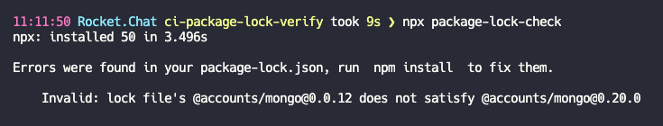

# package-lock-check
Check if package lock is up to date with package.json

## install
```shell
npm i package-lock-check
```
or to execute directly
```shell
npx package-lock-check
```

## run
```shell
package-lock-check [path]
```
**path** is optional, default `./`

## result
Will check if the package-lock.json file is in sync with the package.json dependencies.
Exists with 0 if everything is ok
Exists with 1 if it's out of sync and prints the issues


